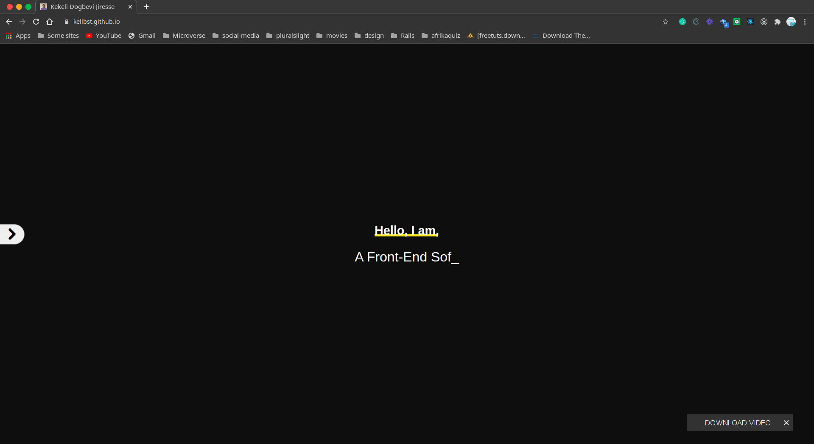

# Kekeli
my personal portfolio, built with React and completely responsive


# Requirements

1.A fully responsive web application


# Screenshot


# Live Demo
[Live Demo Link]() 


# Built With

- HTML 
- CSS
- SCSS
- REACT-BOOTSTRAP
- NPM
- REACT
- NODE
- HEROKU
- GITHUB ACTIONS

### Usage
- Clone the project 
```
git clone https://https://github.com/kelibst/kekeli.git
```
- Run `npm install` to install the local dependencies
- Run `npm start` to launch local development server


## Authors

👤 **Kelly Booster**

- Github: [@kelibst](https://github.com/kelibst)
- Twitter: [@keli_booster](https://twitter.com/keli_booster)
- Linkedin: [Kekeli (Jiresse) Dogbevi
](https://www.linkedin.com/in/kekeli-dogbevi-jiresse/)


# 🤝 Contributing
Contributions, issues and feature requests are welcome!
Feel free to check the issues page

Design idea by [Alexey Savitskiy on Behance](https://www.behance.net/alexey_savitskiy)

# Show your support
Give a ⭐️ if you like this project!

This project is [MIT](lic.url)